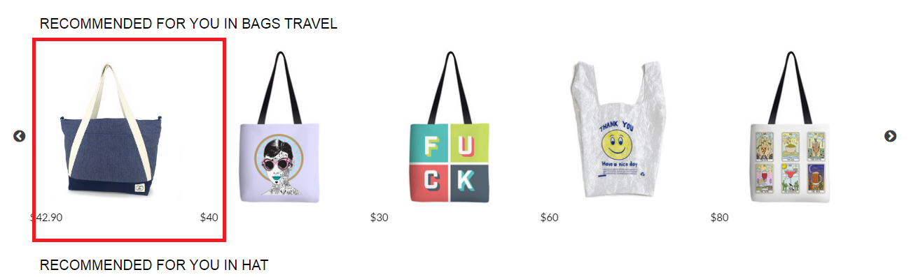

## Proyecto FAB.COM usando FOUNDATION
Este proyecto se realizó como un reto en equipo


## Desarrollo con:
```sh
  - HTML
  - JS
  - CSS
  - FOUNDATION
```

## Descripción
  Se realizó la página web de Fab.com https://fab.com/ haciendo uso del framework FOUNDATION.
  Link del gh-pages: https://mgmp2.github.io/ProjectFoundation/

+ MENÚ
Se realizazó el menú mostrado con los requerimientos realizados. Se puede visualizar el logo, un buscador, además de el login.


  

+ PORTADA
  

+ PRODUCTOS
  

+ FOOTER
  

## Para ver la funcionalidad de agregar al carrito, hacer clicn en la siguiente imagen


  
### Members

- Marilu Llamoca
  

- Miriam Mendoza
  

- Arantza Burga
  
