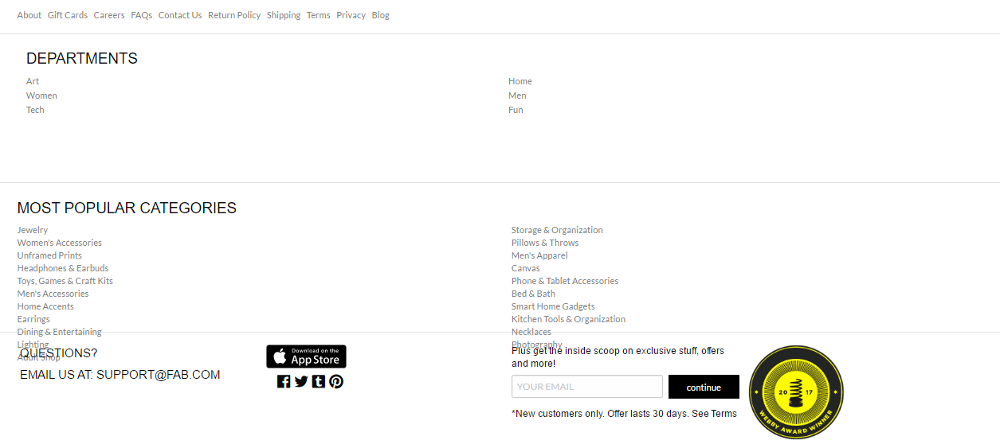

## Proyecto FAB.COM usando FOUNDATION
Este proyecto se realizó como un reto en equipo


## Desarrollo con:
```sh
  - HTML
  - JS
  - CSS
  - FOUNDATION
```

## Descripción
  Se decidió realizar la consigna de copia de la página web de Fab.com https://fab.com/ haciendo uso del framework FOUNDATION.

+ MENÚ
Se realizazó el menú mostrado con los requerimientos realizados. Se puede visualizar el logo, un buscado, además de el login.
  

+ PORTADA
  

+ PRODUCTOS
  

+ FOOTER
  

### Members

- Marilu Llamoca
  

- Miriam Mendoza
  

- Arantza Burga
  
